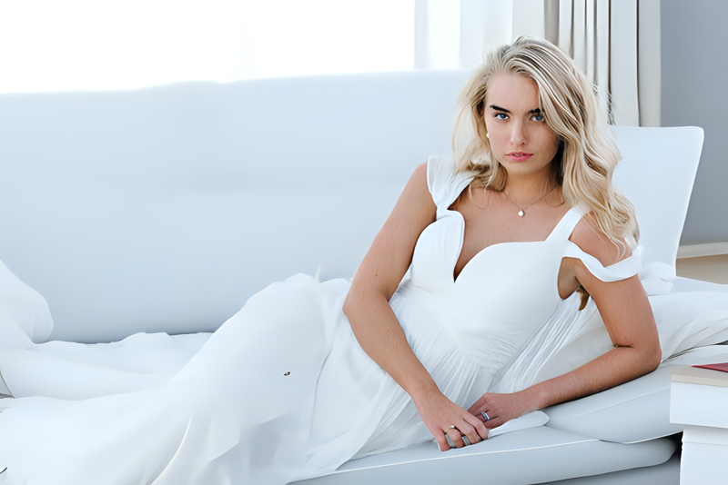
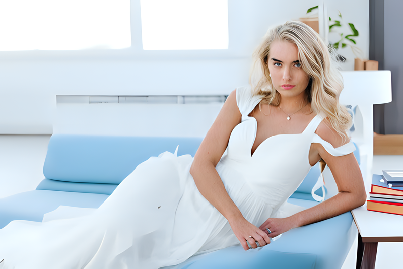
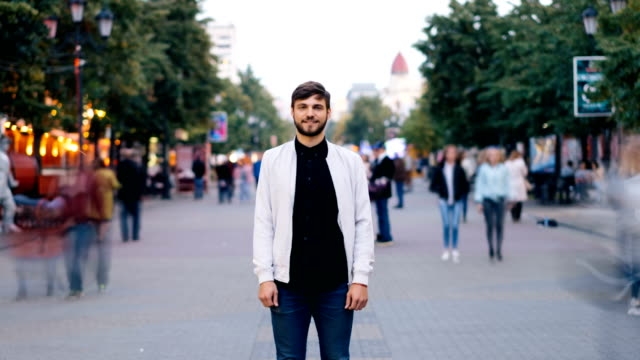
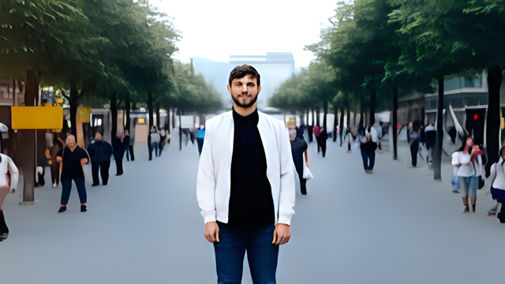

# Using TRACER and Stable Diffusion to changing background in image with prompt

Update Task :

- Background Diffusion
- Background Removal
- Remove Object with Inpainting
- Inpainting image

## Background Changing Example

|Order | Text Prompt | Image Imput | Output Image | Size Image (width, height) | Step |
|------|-------------|-------------|--------------|------------|-------|
| 1 | A lady standing in Office of Technology Company, a bright office job. |  | |  (500, 750) | 20 |
| 2 | A lady standing before The warm Coffee House with some plants , some lamp and a big bookself |  | | (500, 750) | 20 |
| 3 | Red Sofa |  | | (500, 750) | 20 |
| 4 | A young woman is lying on a blue sofa, next to a table with a lamp and some books, in a shinesine house. This house have bookself. |  | | (500, 750) | 20 |
| 5 | A Coffe House |  | | (640, 360) | 20 |
| 6 | A man is standing in a pedestrian street with lots of trees and lots of sunlight. |  | | (640, 360) | 20 |
| 7 | The man is standing in front of a cafe with a few tall trees and a bus stop |  | | (960, 550) | 20 |

## Background Removal Example

|Order | Image Imput | Output Image |
|------|-------------|--------------|
| 1 |  |  |
